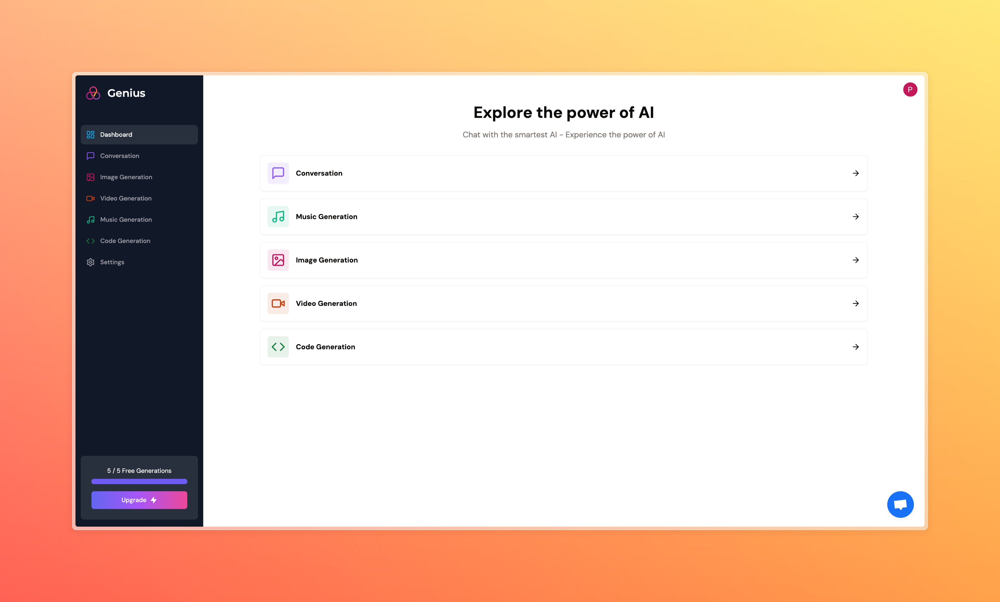
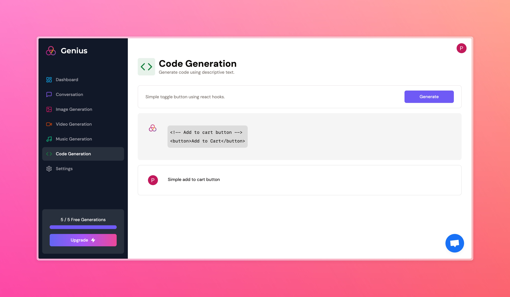
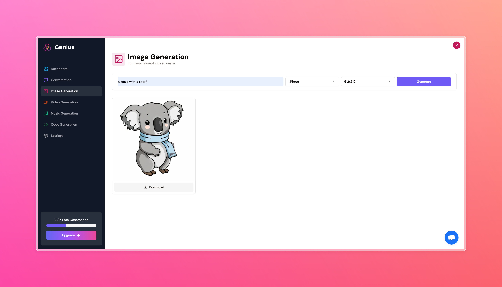

# 🤖 AI SaaS Platform (Genius)






## Overview

A powerful AI Software as a Service (SaaS) platform developed by Pakagrong Lebel, inspired by and following Antonio's tutorial. This platform integrates multiple AI capabilities including conversation, image generation, video creation, music composition, and code generation.

## 🚀 Features

- **Conversation AI**: Engage in natural language conversations
- **Image Generation**: Create unique images from text descriptions
- **Video Generation**: Generate videos from text prompts
- **Music Creation**: Compose music using AI
- **Code Generation**: Generate code snippets and solutions
- **Authentication**: Secure user authentication with Clerk
- **Subscription Management**: Stripe integration for payments
- **Free Tier**: Limited free API calls
- **Pro Tier**: Unlimited API access with subscription



Video Generation


Music Generation


## 💻 Tech Stack

- **Frontend**: 
  - Next.js 13
  - React 18
  - Tailwind CSS
  - Shadcn UI
  - TypeScript

- **Backend**:
  - Next.js API Routes
  - Prisma ORM
  - PostgreSQL (via Neon.tech)

- **AI Services**:
  - OpenAI API
  - Replicate API

- **Authentication & Payments**:
  - Clerk Authentication
  - Stripe Payment Integration

- **Deployment**:
  - Vercel Platform
  - Neon PostgreSQL


## 🛠️ Installation

1. Clone the repository:
```bash
git clone https://github.com/pakagronglb/ai-saas-platform.git
```

2. Install dependencies:
```bash
npm install
```

3. Set up environment variables:
```bash
# Create a .env file with the following variables
DATABASE_URL=
NEXT_PUBLIC_CLERK_PUBLISHABLE_KEY=
CLERK_SECRET_KEY=
NEXT_PUBLIC_CLERK_SIGN_IN_URL=
NEXT_PUBLIC_CLERK_SIGN_UP_URL=
NEXT_PUBLIC_CLERK_AFTER_SIGN_IN_URL=
NEXT_PUBLIC_CLERK_AFTER_SIGN_UP_URL=

OPENAI_API_KEY=

REPLICATE_API_KEY=

STRIPE_API_KEY=
STRIPE_WEBHOOK_SECRET=

NEXT_PUBLIC_APP_URL=
```

4. Run Prisma migrations:
```bash
npx prisma db push
```

5. Start the development server:
```bash
npm run dev
```

## 📝 Usage

1. Create an account or sign in
2. Choose an AI service from the dashboard
3. Input your prompt or requirements
4. Generate AI content
5. Upgrade to Pro for unlimited access

## 💳 Subscription Plans

- **Free Tier**:
  - 5 generations per month
  - Access to all tools
  - Basic support

- **Pro Tier**:
  - Unlimited generations
  - Priority access
  - Premium support
  - Early access to new features

## 🙏 Credits

This project was built following [Antonio's](https://twitter.com/antonioerdeljac) comprehensive tutorial. While I've implemented and customized the platform, the original concept and architecture were created by Antonio.

## 📄 License

This project is licensed under the MIT License - see the [LICENSE](LICENSE) file for details.

## 🤝 Contributing

Contributions, issues, and feature requests are welcome! Feel free to check the [issues page](https://github.com/pakagronglb/ai-saas-platform/issues).

## 📧 Contact

Pakagrong Lebel - [pakagronglebel@gmail.com]

Project Link: [https://github.com/pakagronglb/ai-saas-genius](https://github.com/pakagronglb/ai-saas-platform)

---

⭐️ If you found this project helpful, please give it a star!
